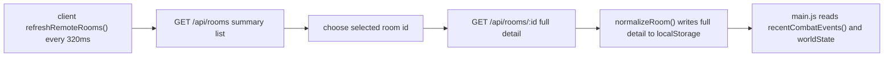

# P0 Active-Room Detail Cursor Design - 2026-05-23

Conclusion: P0-6A implemented the smallest useful cut: cursor-based `/api/rooms/:id` detail delta for normal players. It reduces combat-grown active-room detail payloads without a WebSocket rewrite, admin split, AI ownership change, or fetch cadence change.

## Current Evidence

- `/api/rooms` already returns summary records and excludes `chat`, `events`, `commands`, `combatEvents`, and `worldState`.
- `/api/rooms/:id` still returns full selected-room detail.
- The client refresh loop calls `/api/rooms` and one selected `/api/rooms/:id` every 320 ms.
- `exportClientRoom()` includes recent windows of `chat` 120, `events` 80, `commands` 120, `combatEvents` 140, and full `worldState`.
- Small-arms browser probe still shows selected-room detail around 42-44 KB average and up to about 77-79 KB max.

## Current Flow



## Payload Sources

| Source | Current behavior | Risk |
| --- | --- | --- |
| `combatEvents` | Full selected-room window up to 140 events every detail fetch. | Biggest measured growth during small-arms combat. |
| `worldState` | Full world state is returned every detail fetch even if unchanged; host publishes about every 1.8 s. | Wasteful repeated payload and future AI-count risk. |
| `chat` / `commands` / `events` | Large windows are included in full detail even when unchanged. | Lower immediate load than combat, but will matter in admin/lobby-heavy sessions. |
| Fetch frequency | Detail fetch runs with the same 320 ms cadence as room-list refresh. | Payload cost repeats even when only a few fields changed. |
| Admin/observer | Admin/observer currently uses the same room detail flow plus admin snapshots. | Needs more data than players; should not be optimized blindly with the player path. |

## Implemented Design

P0-6A adds a delta mode to the existing detail endpoint:

`GET /api/rooms/:id?delta=1&combatAfter=<serverSeq>&worldStateAfter=<updatedAt>&view=player`

Response shape:

```json
{
  "ok": true,
  "room": {
    "id": "room-id",
    "summary": false,
    "detailDelta": true,
    "players": [],
    "spectators": [],
    "admins": [],
    "combatEvents": [],
    "worldState": null,
    "chat": [],
    "events": [],
    "commands": [],
    "combatServerSeq": 123,
    "worldStateUpdatedAt": 1779510000000,
    "updatedAt": 1779510000000
  },
  "cursors": {
    "combatServerSeq": 123,
    "worldStateUpdatedAt": 1779510000000,
    "chatUpdatedAt": 1779510000000,
    "eventsUpdatedAt": 1779510000000,
    "commandsUpdatedAt": 1779510000000
  }
}
```

Rules:

- Initial selected-room fetch stays full when no cursor exists.
- Subsequent normal-player detail fetches request `delta=1`.
- `combatEvents` returns only events newer than `combatAfter`, with a safe fallback recent window if the cursor is missing or stale.
- `worldState` returns `null` when `worldState.updatedAt <= worldStateAfter`; client keeps its previous state.
- `chat`, `events`, and `commands` remain full detail windows for this cut.
- Client merge dedupes by `id`, `hitId`, `shotId`, `deathId`, and `respawnId`, preserving optimistic combat events and server confirms without duplicates.
- Admin/observer should keep full detail for the first P0-6A cut, or pass `view=admin` to explicitly request fuller windows.

## Minimum Implementation Scope

P0-6A: normal-player active-room combat/world delta.

- Add detail query parsing in `tools/static-server.cjs`.
- Add a small `exportClientRoomDetail(room, options)` wrapper around `exportClientRoom()`.
- In delta mode:
  - return only `combatEvents` with `serverSeq > combatAfter`;
  - return `worldState: null` if unchanged;
  - include current cursors.
- Add client-side per-room cursors and merge logic in `src/systems/room-registry.js`.
- Keep `/api/rooms` summary, `/participants`, `/combat`, WebSocket, admin separation, AI ownership, and interpolation unchanged.
- Extend `tools/check-p0-http-combat-load.cjs` to report full-vs-delta detail bytes.

## Defer

- Detail fetch frequency changes. Keep 320 ms for P0-6A so byte reduction is isolated.
- Admin/observer-specific detail split.
- Chat/events/commands cursor fields.
- WebSocket player/combat transport.
- AI/worldState ownership changes.
- Large command/chat window redesign.

## Risks

| Risk | Severity | Mitigation |
| --- | --- | --- |
| Client misses combat events after tab pause or cursor reset. | High | If cursor is absent/stale, server returns a recent fallback window; client keeps existing seen-id dedupe. |
| Delta merge overwrites previous `worldState` with `null`. | High | `normalizeRoom()` or merge layer must preserve previous `worldState` when `detailDelta` is true and `worldState` is null. |
| Admin UI loses older commands/chat if it accidentally uses player delta. | Medium | Gate by `view=player`; admin/observer stays full for P0-6A. |
| Tests assume full room detail. | Medium | Update only P0 measurement scripts and add delta-specific assertions. |
| Payload shrinks but localStorage writes remain high. | Medium | Expected for P0-6A; localStorage write-count tuning is a later branch. |

## P0-6A Result

Implementation files:

- `tools/static-server.cjs` routes detail requests through `server/room-detail-response.js`.
- `server/room-detail-response.js` owns room summary/detail delta shaping.
- `src/systems/room-registry.js` stores per-room cursors and merges delta detail into existing room state.
- `tools/check-p0-http-combat-load.cjs` and `tools/p0-http-load-summary.cjs` report full-vs-delta detail bytes and fail on combat event sync mismatch.

API replay result:

| Scenario | Final full detail | Final unchanged delta | Event sync |
| --- | ---: | ---: | --- |
| participant only | 3,327 B | 3,253 B | PASS |
| small arms | 75,738 B | 3,253 B | PASS |
| projectile launch/impact | 23,347 B | 3,255 B | PASS |
| admin snapshot observer | 42,798 B | 4,639 B | PASS |

Headless browser result:

| Scenario | Avg detail payload | Frame result | Errors |
| --- | ---: | --- | ---: |
| movement only | 3,470 B | avg 16.8 ms / max 33.4 ms | 0 |
| small arms | 5,684 B | avg 16.7 ms / max 33.4 ms | 0 |
| projectile | 4,038 B | avg 16.7 ms / max 16.8 ms | 0 |
| small arms + admin/observer | 7,051 B | avg 16.7 ms / max 16.8 ms | 0 |

Safety notes:

- `worldState: null` in a delta response preserves the previous client `worldState`.
- A missing or stale combat cursor returns a recent combat event fallback window.
- Standalone `admin.html` keeps full selected-room detail; the headless admin probe uses the normal index path and still records admin snapshot POST size separately.
- The P0 load probe now fails if client combat event counts diverge from the final server detail count.
- Admin/observer still has a separate large full-room POST risk: the browser probe saw admin `POST /api/rooms` average about 41 KB and max about 79 KB.
- Limited alpha remains HOLD.

## Recommendation

P0-6A can be closed after commit/push. The next automated P0 candidate is admin/observer full-room POST isolation, but only after this cursor change is saved cleanly.
