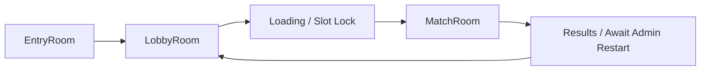

# Online Operations Center

Conclusion: first build the local operations model, AI observatory, and JSON backup flow; real WebSocket rooms and external storage come after these shapes are stable.

## Next Agent Handoff

Use this section when handing the project to another agent. The goal is to avoid broad rewrites and verify the live online build by behavior, not just by source inspection.

Current state:

- Working live URL: `https://iron-line-2d-tank-prototype.onrender.com/`
- Related thread/context id from the user: `019e4571-5ad4-7d63-84f0-3949db22da68`
- Latest GitHub `main` should be checked with `git log -1 --oneline` before continuing.
- Backup branch: `backup/20260521-231336-online-sync-f6e8b4d`
- Backup tag: `backup-20260521-231336-online-sync-f6e8b4d`
- Render live `index.html` includes `src/ai/infantry-base-egress.js`, and the file loads with HTTP 200.
- Live behavioral checks already passed for base egress and scout drone ammo:
  - Infantry moved out of base during live play.
  - Scout loadout showed `3 드론 1`.
  - Runtime `player.equipmentAmmo.reconDrone` was observed as `1`.
- Live console showed no fatal game errors. The only observed warning was browser fullscreen policy blocking a non-user-gesture fullscreen request.
- GitHub `main` includes online combat sync, remote marker smoothing, and a build/deploy check path (`/api/build` plus a settings/admin build badge). Render live was still serving an older `src/main.js` after push. Treat this as a deployment path/manual deploy issue until proven otherwise.

Priority order:

1. Reproduce behavior on the Render live URL, not only local `npm start`.
2. Check browser console errors and page errors.
3. Compare Render live assets against GitHub `main`, especially `src/main.js`, `src/systems/renderer.js`, and `tools/static-server.cjs`.
   - First check `https://iron-line-2d-tank-prototype.onrender.com/api/build`.
   - Then confirm the visible settings/admin build badge and console `[Iron Line build]` output match GitHub `main`.
4. Confirm infantry base egress works in actual play.
5. Confirm scout recon drone ammo remains fixed at `1` in UI and runtime state.
6. If something fails, make the smallest code fix possible.
7. Run `npm run check` and `git diff --check`.
8. Commit/push, then verify the final live URL after Render redeploy.

Constraints:

- Do not do a large refactor while verifying deployment.
- Do not revert unrelated existing changes.
- Remember that Render may not be serving the same source path as GitHub Pages or the current local folder.
- A fix is not done until the Render URL itself demonstrates the behavior.

## Purpose

This document fixes the first online/admin direction for Iron Line. The game should support 4v4 human squad leaders later, while still feeling like a larger battle because each player owns AI squads and vehicles. The admin side must be able to observe rooms, match state, AI behavior, and backups without becoming a player-only debug panel.

## Current Scope

Current implementation is local-first:

- `admin.html` is a separate observer/admin surface.
- `index.html?admin=1` can still open the in-game admin panel.
- `AdminOps` creates a local `AdminSnapshot` and backup JSON.
- `ObserverBridge` shares live match snapshots through browser-local observer storage/channel.
- `AIObservatory` records AI decisions, issues, and recent event logs.
- Real online server sync, authentication, kick/ban, and Google Drive storage are future work.

## Room Flow



## Key State

### EntryRoom

First contact state before a player joins a combat lobby.

```js
{
  roomId,
  displayName,
  locked,
  playerCount,
  spectatorCount,
  mode,
  phase
}
```

### LobbyRoom

Pre-match room where the 4v4 slots are selected and readied.

```js
{
  roomId,
  phase: "lobby",
  joinLocked: false,
  allowMidMatchJoin: false,
  config: RoomConfig,
  slots: PlayerSlot[],
  players: []
}
```

### RoomConfig

Admin-owned match setup. Players should not mutate this directly.

```js
{
  roomId,
  mode: "annihilation" | "conquest",
  durationSeconds,
  maxPlayersPerTeam: 4,
  allowEmptyAiSlots,
  allowMidMatchJoin: false,
  mapId,
  balancePresetId
}
```

### PlayerSlot

One human role slot. Empty slots stay AI controlled.

```js
{
  id,
  team,
  roleId: "infantry" | "engineer" | "recon" | "armor",
  playerId,
  aiControlled,
  locked,
  squadIds,
  vehicleIds,
  unitIds,
  droneIds
}
```

### CommandPacket

All online-ready actions should become command packets. Clients should not directly mutate unit state.

```js
{
  id,
  roomId,
  tick,
  issuedAt,
  issuerPlayerId,
  team,
  slotId,
  authority: "owned_squad" | "admin" | "server",
  type: "move" | "attack" | "defend" | "rally" | "cancel",
  targetSquadIds,
  targetVehicleIds,
  targetPoint,
  objectiveName,
  stance,
  priority,
  ttl
}
```

### AdminSnapshot

Operations center read model. This is what the admin panel should render from.

```js
{
  kind: "iron-line-admin-snapshot",
  version,
  createdAt,
  roomId,
  server: {
    roomCount,
    activeMatches,
    clientCount,
    playerCount,
    adminCount,
    spectatorCount,
    persistence
  },
  room,
  match,
  ai,
  commands,
  backup,
  providers
}
```

### AiObserverSnapshot

AI lab read model. It must explain behavior before changing behavior.

```js
{
  version,
  updatedAt,
  roomId,
  phase,
  paused,
  summary: {
    total,
    squads,
    vehicles,
    warnings,
    issueCounts,
    decisionCounts
  },
  units: [
    {
      kind: "squad" | "vehicle",
      aiType,
      id,
      team,
      state,
      order,
      target,
      stuck,
      decision: {
        decision,
        reason,
        reasonLabel,
        score,
        scores,
        facts
      },
      issues
    }
  ],
  events
}
```

### BackupManifest

Free server resets are expected, so the first backup target is JSON.

```js
{
  kind: "iron-line-admin-backup",
  version,
  exportedAt,
  day,
  timezone: "Asia/Seoul",
  reason,
  summary,
  data: {
    snapshot,
    roomConfig,
    matchConfig,
    conquest,
    onlineSession,
    aiEvents,
    commandLog,
    map
  }
}
```

## Admin Panel 1차

Tabs:

- 플레이어
- 스폰
- AI
- 운영센터
- 관전
- 백업은 현재 운영센터 안에 포함한다. 나중에 기능이 커지면 독립 탭으로 뺀다.

Current local snapshot values:

- room count: `1`
- player count: local session player count
- AI squad count: from `AIObservatory.summary.squads`
- tank/humvee/infantry counts: from live game state or observer snapshot
- recent AI logs: from `AIObservatory.events`
- match phase and score: from `matchConfig`, `matchPhase`, `conquest`

## AI Lab 1차

AI lab is observational only.

Show:

- squad list
- tank/humvee list
- selected AI current state
- why it did not fire
- why it could not move
- why it did not unload
- stuck timer
- current order
- recent decision logs

Do not do in this phase:

- rewrite AI behavior
- add neural network behavior
- let admin controls silently change AI decisions

## Backup 1차

Functions:

```js
exportAdminBackup()
importAdminBackup()
```

Current implementation names:

- `AdminOps.createBackup()`
- `AdminOps.downloadBackup()`
- `AdminOps.importBackupText()`
- `AdminOps.importBackupFile()`
- `AdminOps.saveLocalBackup()`
- `AdminOps.restoreLocalBackup()`

Backup targets now:

- `RoomConfig`
- `matchConfig`
- map layout metadata
- admin settings placeholder
- AI event sample
- balance preset placeholder

Future storage providers:

- browser JSON export/import
- server-side rotating backup
- Google Drive or other external provider

## Risks

- `Game` and `Hud` are already large. New admin-specific UI should move toward an admin UI module instead of continuing to grow `hud.js`.
- Admin observer must stay separate from normal player UI. Players should not see admin-only panels.
- Online should sync command packets and authoritative state, not raw client-side unit mutation.
- AI improvement should start from logged reasons and score data, not from rewriting all AI.

## Recommended Next Steps

1. Keep the current local `AdminSnapshot` and `AiObserverSnapshot` stable.
2. Split admin UI rendering from `hud.js` into a smaller admin module.
3. Add a local room registry model matching `EntryRoom` and `LobbyRoom`.
4. Move lobby slot selection onto `PlayerSlot`.
5. Convert remaining player/role commands to `CommandPacket`.
